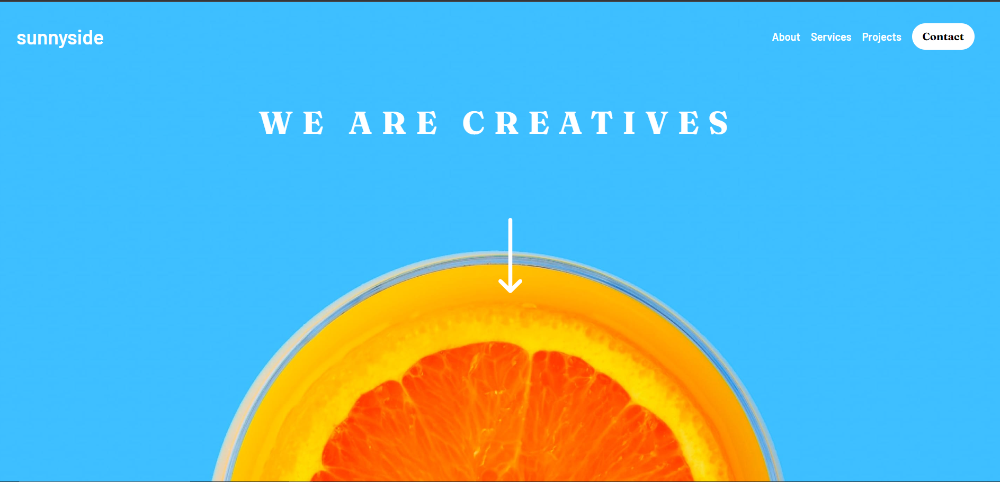
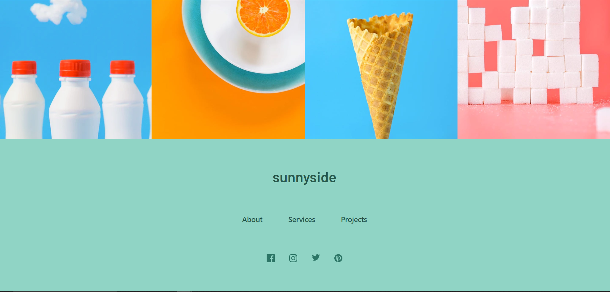
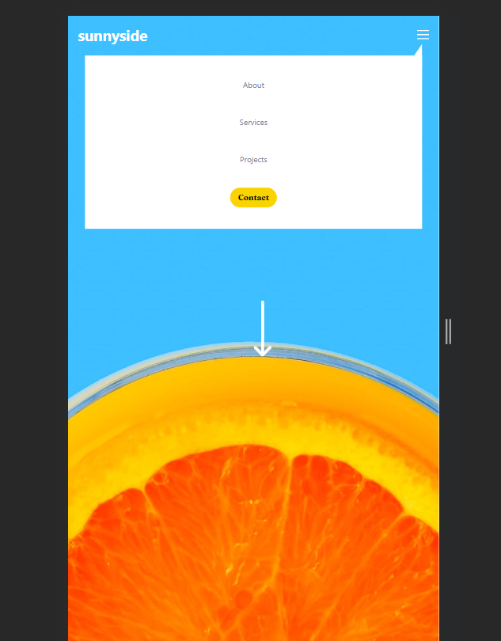
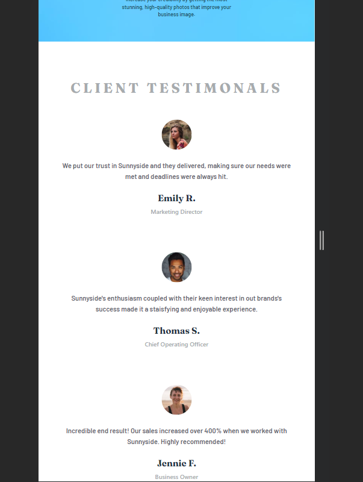
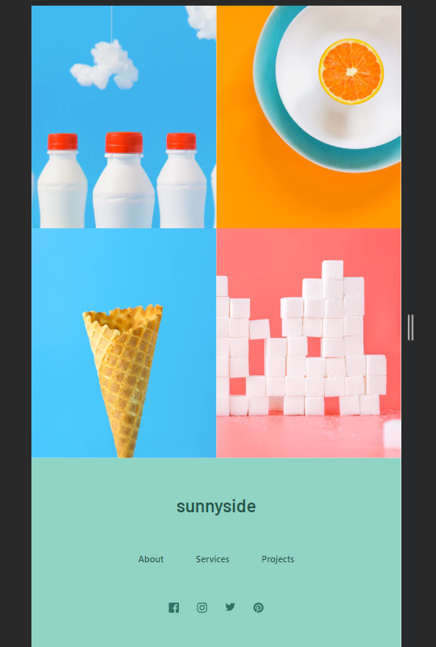

# Frontend Mentor - sunnyside-agency-landing-page-main

## Table of contents

- [Overview](#overview)
  - [Screenshot](#screenshot)
  - [Links](#links)
- [My process](#my-process)
  - [Built with](#built-with)
  - [What I learned](#what-i-learned)
  - [Continued development](#continued-development)
  - [Useful resources](#useful-resources)
- [Author](#author)

## Overview

### Screenshot

### Links

- [Repo Link](https://github.com/Sonualam-bot/sunnyside-agency-landing-page-main)
- [Live Link]()

### Built with

- Flexbox
- Grid
- Mobile-first workflow
- [React](https://reactjs.org/) - JS library
  -Tailwind Css
- For styles

### What I learned

Understood working of grid in tailwind css and also the benefit of using it to conditionally render row or columns according to row flow of col flow. Played with grid and flexbox to get the desired output. Good chunk of time spent of learning to implement this and it's feels rewarding learnt few new tricks about using tailwind.Learnt about using flex-basis, this is the game changer property.Awsome enjoyed my time making this.

## Author

- Website - [Md. Sonu Alam](https://renon-portfolio-kappa-one.vercel.app/)
- Frontend Mentor - [@sonualam](https://www.frontendmentor.io/profile/yourusername)
- Twitter - [@muhammadsonu](https://twitter.com/muhammadsonu15)
